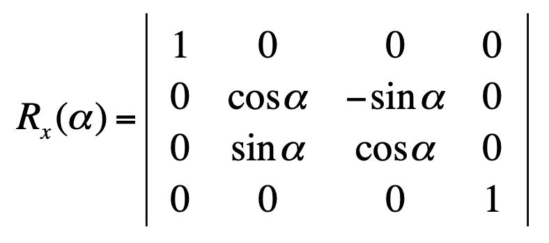

## Basic Transforms

### Translate

### Scaling

#### Mirroring

- Planar

    for example if we want to mirror along zy-plane:\
    \
    \
    
    
- Axial

    for example if we want to mirror along y-axis:\
        \
        \
        
        
- Central

    \
    \
    

#### Flatten

for example if you want to flatten x:\
&nbsp;&nbsp;&nbsp;&nbsp; \
&nbsp;&nbsp;&nbsp;&nbsp; \
&nbsp;&nbsp;&nbsp;&nbsp; 

### Rotation

- X rotation\
    
    
- Y rotation\
    

- Z rotation\
    
    
### Shear

- Shear along X axis\
    

- Shear along Y axis\
    

- Shear along Z axis\
    