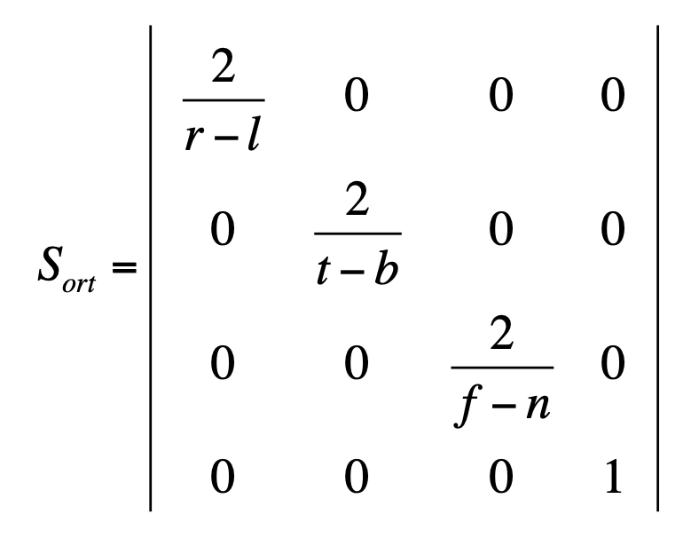
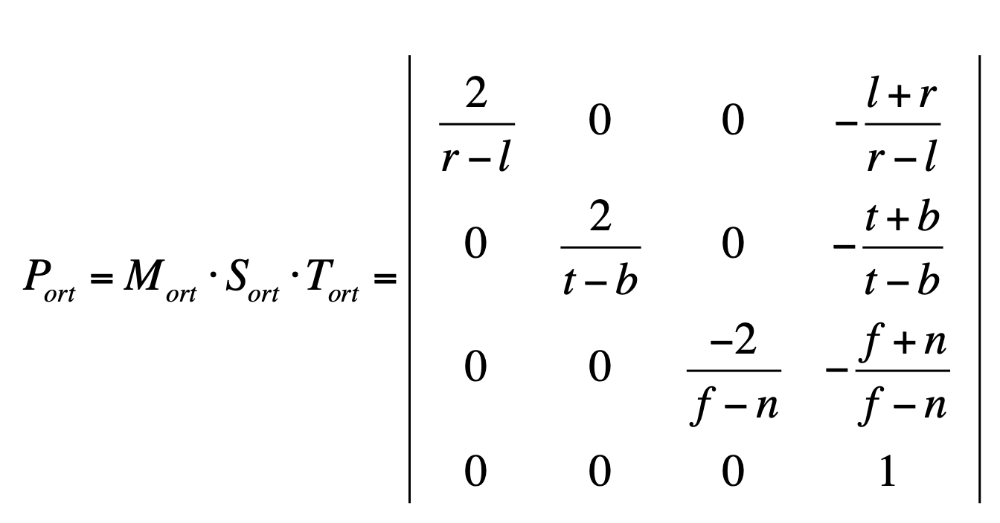

# Orthogonal Parallel Projection

orthogonal projection has three steps:

1. Translate center:

2. Normalize coordinates:

3. Convert from right handeed to left handed:

The Formula is:\

-----
#### With having half width

The formula is:\

 is half width and 

 is aspect ratio