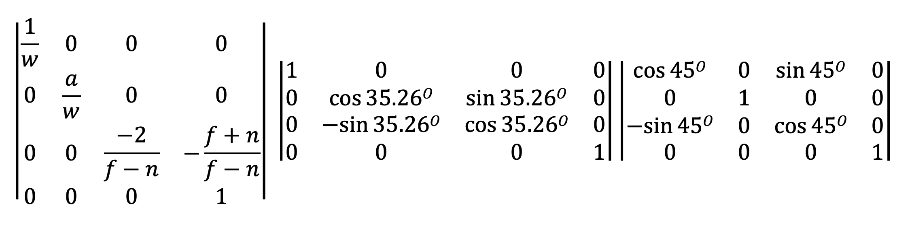
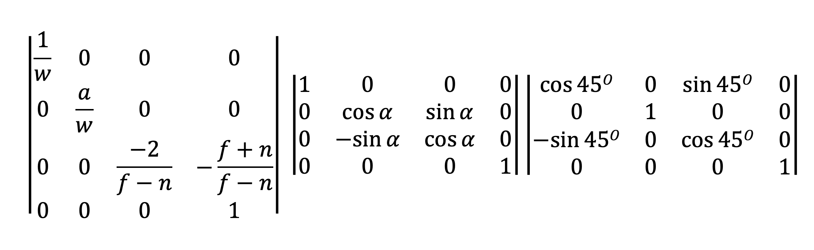
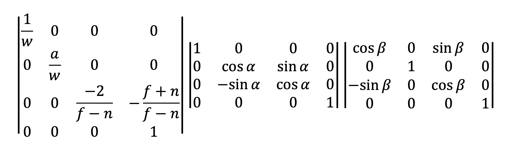
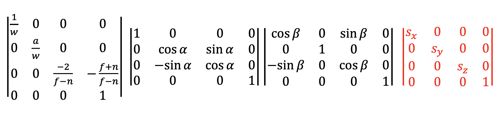
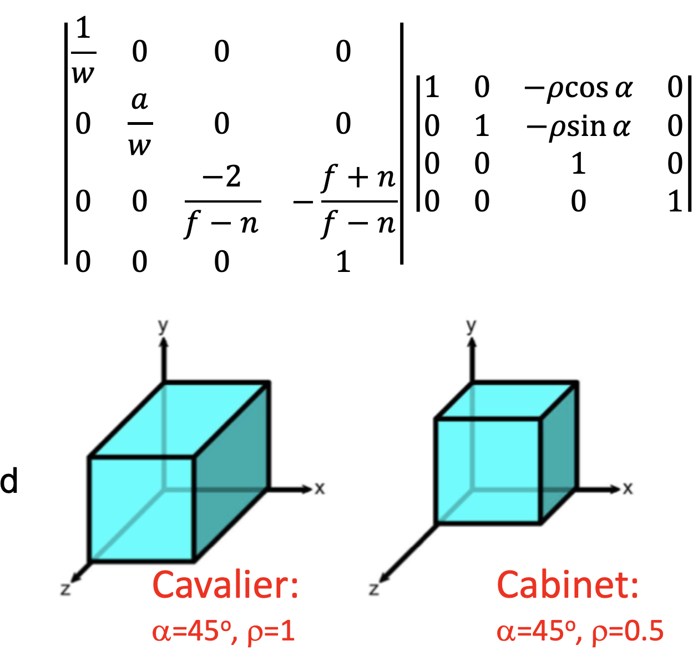

# Axonometry

The most important types of orthographic axonometric projections are:

- Isometric \
In isometric projections the three axes are angled at 120o one from the other.

- Dimetric \
Dimetric projections have two different units: one for the x and z-axis and one for the y-axis.
 
- Trimetric \
All the angles between the projections of the axes are different.

### Isometric
Isometric projections are obtained by applying a rotation of ±45o around the y-axis, followed by a rotation of ±35.26o around the x-axis, before applying the parallel projection previously seen.

### Dimetric
Dimetric projections are obtained by applying a rotation of ±45o around the y-axis, followed by an arbitrary rotation a around the x-axis, before applying the basic parallel projection.

### Trimetric
Trimetric projections are obtained by applying an arbitrary rotation b around the y-axis, followed by an arbitrary rotation a around the x-axis, before applying the parallel projection previously seen.

#### Foreshortening and Scaling
Note that the combination of the rotation, reduces the size of the sides of the objects.

---
## Oblique projections
In oblique projections rays are parallel, but oblique with respect to the projection plane.\
This has the effect that two of the three axes (namely x and y) are parallel to the screen.\
The third one (the z-axis) is oriented at an angle with respect to the previous two.

