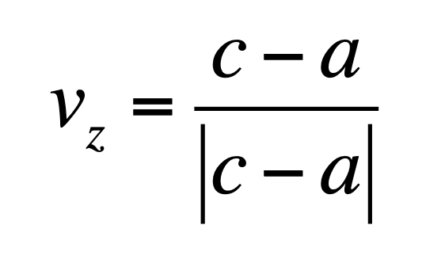
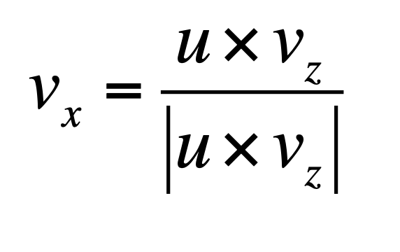
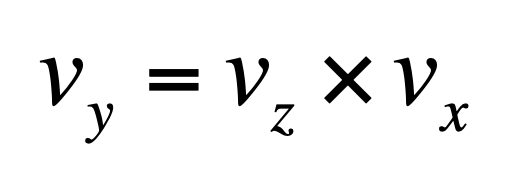
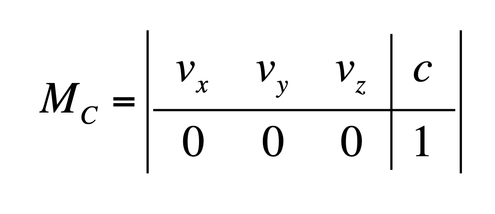
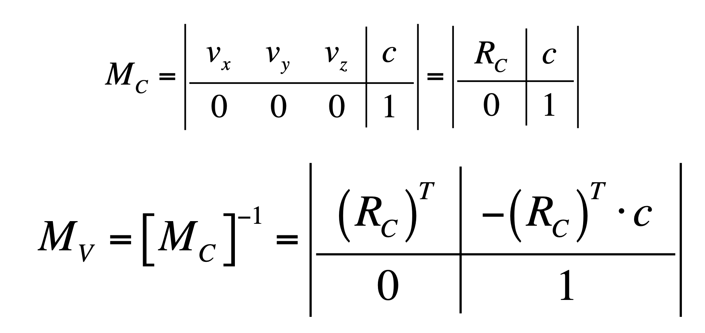
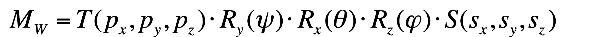

# View Matrix: 

## Look-At:

5 Steps required:

#### 1- We first determine the transformed (negative) z-axis as the normalized vector that ends into the camera center and that starts from the point that it is looking.

*here we use ```utils.normalizeVector3(V)``` to normalise the vectors*



#### 2- The new x-axis should be perpendicular to both the new z- axis, and the up-vector: 
it can be computed via the normalized cross product of the two



#### 3- Finally, the new y-axis should be perpendicular to both the new z-axis and the new x-axis. 
This could be computed via the cross product of the two vectors just obtained.

Since both the new z-axis and the new x-axis are already unit vectors, no further normalization is required.



#### 4- The Camera Matrix MC can then be computed by placing the vectors in the first three columns and the position of the center in the fourth.



#### 5- Inverting the Camera Matrix:




# World Matrix 

The World Matrix can then be computed by factorizing the five transformations in the correct order:


