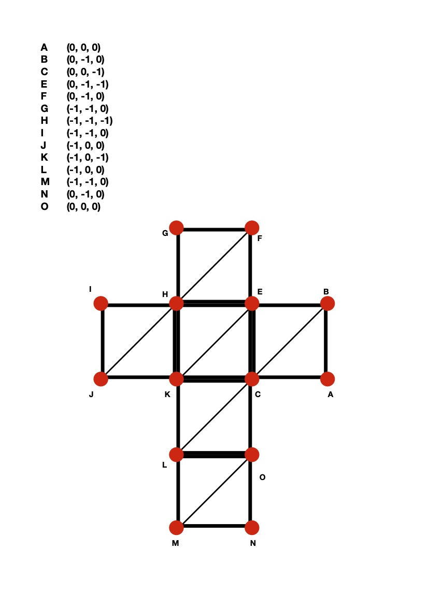
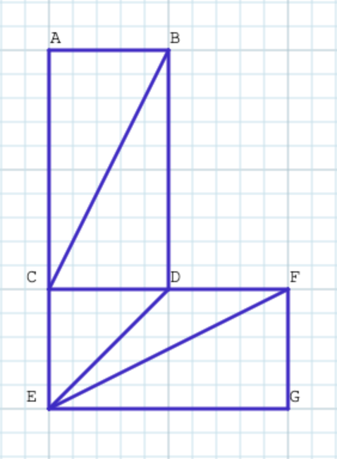
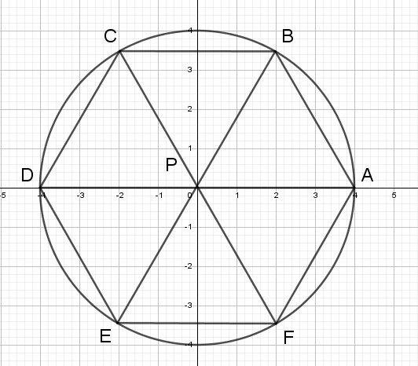
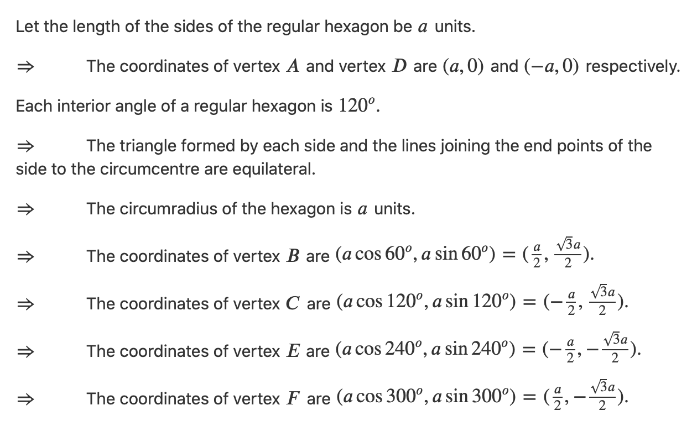

# TriangleLists

**Triangle lists do not exploit any sharing of vertices, and encode each triangle as a set of three different coordinates.**

# Triangle Strips

**Triangle strips encode a set of adjacent triangles that define a band-like surface.**\
The triangle strip logic is quite simple. Starting with the coordinates of the first triangle, each subsequent triangle is produced using the next vertex and the previous two.

sequence: ABCDEFG

# Triangle Fans

**Triangle fans encode polygons where all the triangles share a common vertex.**

