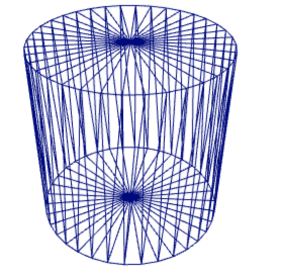
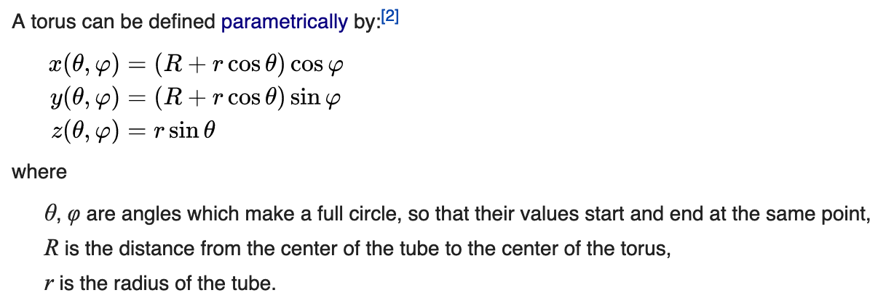
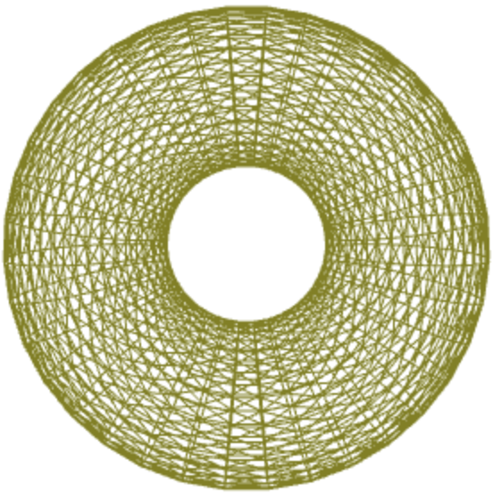

# Indexed primitives

### Cylinder 

**what is Cylinder?**

A cylinder is one of the most basic curved geometric shapes, with the surface formed by the points at a fixed distance from a given line segment, known as the axis of the cylinder. The shape can be thought of as a circular prism. Both the surface and the solid shape created inside can be called a cylinder. The surface area and the volume of a cylinder have been known since ancient times.

we need 36 vertices for each circle and for computing circle vertices we use:


```[Math.sin(i*10.0/180.0*Math.PI), -1.0, Math.cos(i*10.0/180.0*Math.PI)];```

The final shape: 



### Torus

**What is Torus?**

a surface or solid formed by rotating a closed curve, especially a circle, about a line which lies in the same plane but does not intersect it (e.g. like a ring doughnut).

**Torus Formula**

<p float="left">
    
    
</p>
