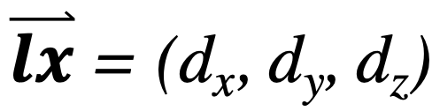
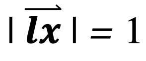
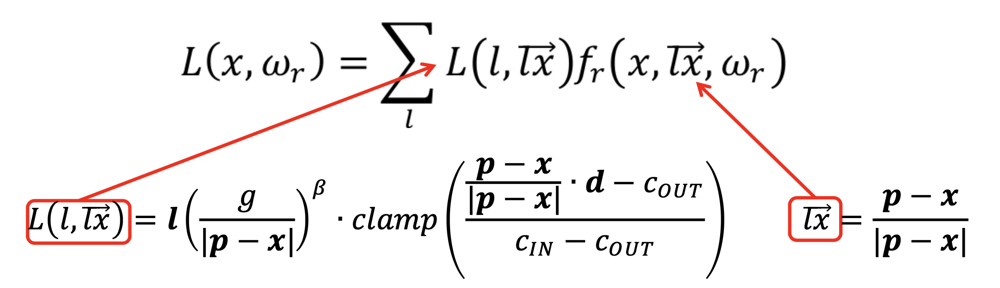
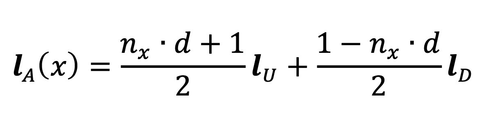

# GLSL Lights

Each light model describes how light is emitted in the different directions of the space. It takes as input the position of a point x of an object. It returns a vector that represents the direction of the light, and a color which accounts for the quantity of light emitted for every wavelength.

The light direction specified with: \
 \

### Direct Light
Directional lights are sources that are very far away from the objects

### Point Light
Point lights are sources that emit light from fixed points in the space, and characterized by their position.

### Spot Light
Spot lights are conic sources characterized by a direction d and a position p.

### Hemispheric lighting
The two colors, lU and lD, represent the values of the ambient light at the two extremes, and the direction vector d orients the
blending of the two colors

